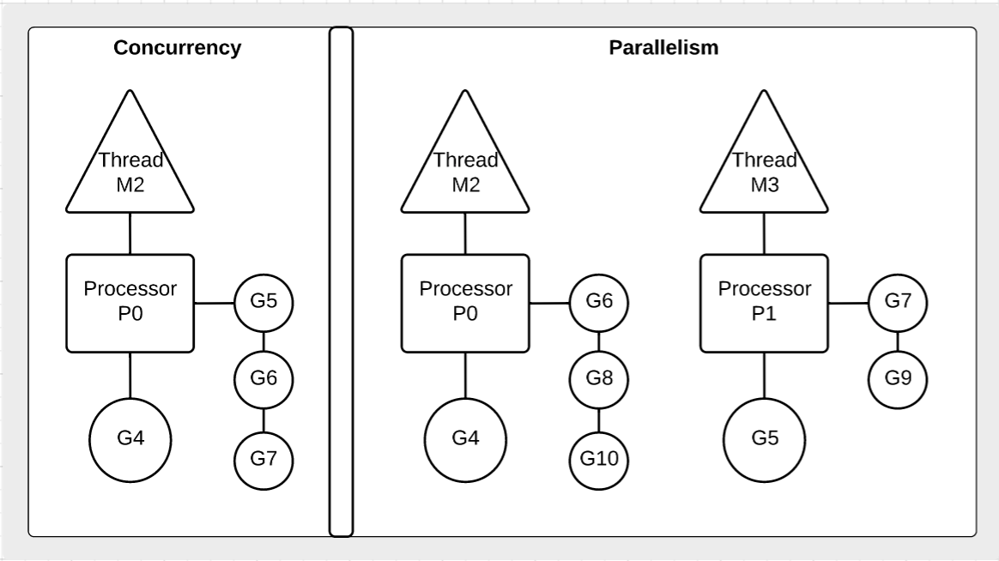

## Goroutines

Goroutines are functions that are created and scheduled to be run independently by the Go scheduler. The Go scheduler is responsible for the management and execution of goroutines.

## Notes

* Goroutines are functions that are scheduled to run independently.
* We must always maintain an account of running goroutines and shutdown cleanly.
* Concurrency is not parallelism.
	* Concurrency is about dealing with lots of things at once.
	* Parallelism is about doing lots of things at once.

## Design Guidelines

* Learn about the [design guidelines](../../../reading/design_guidelines.md#writing-concurrent-software) for concurrency.

## Diagrams

### How the scheduler works.

### Difference between concurrency and parallelism.

## Links

http://blog.golang.org/advanced-go-concurrency-patterns  
http://blog.golang.org/context  
http://blog.golang.org/concurrency-is-not-parallelism  
http://talks.golang.org/2013/distsys.slide  
[Go 1.5 GOMAXPROCS Default](https://docs.google.com/document/d/1At2Ls5_fhJQ59kDK2DFVhFu3g5mATSXqqV5QrxinasI/edit)  
http://www.goinggo.net/2014/01/concurrency-goroutines-and-gomaxprocs.html  
[The Linux Scheduler: a Decade of Wasted Cores](http://www.ece.ubc.ca/~sasha/papers/eurosys16-final29.pdf)  
[Explanation of the Scheduler](https://news.ycombinator.com/item?id=12460807)  
[15 Years of Concurrency](http://joeduffyblog.com/2016/11/30/15-years-of-concurrency/) - Joe Duffy  

## Code Review

[Goroutines and concurrency](example1/example1.go) ([Go Playground](https://play.golang.org/p/eV4l2JqLZL))  
[Goroutine time slicing](example2/example2.go) ([Go Playground](https://play.golang.org/p/8NwVeZG6IB))  
[Goroutines and parallelism](example3/example3.go) ([Go Playground](https://play.golang.org/p/5A0VFp03vb))  
[Less is more](example4/example4_test.go) ([Go Playground](https://play.golang.org/p/KVATlp9xI1))

## Exercises

### Exercise 1

**Part A** Create a program that declares two anonymous functions. One that counts down from 100 to 0 and one that counts up from 0 to 100. Display each number with an unique identifier for each goroutine. Then create goroutines from these functions and don't let main return until the goroutines complete.

**Part B** Run the program in parallel.

[Template](exercises/template1/template1.go) ([Go Playground](https://play.golang.org/p/kjtlMXkAAv)) | 
[Answer](exercises/exercise1/exercise1.go) ([Go Playground](https://play.golang.org/p/pUV-FPd3CE))
___
All material is licensed under the [Apache License Version 2.0, January 2004](http://www.apache.org/licenses/LICENSE-2.0).
